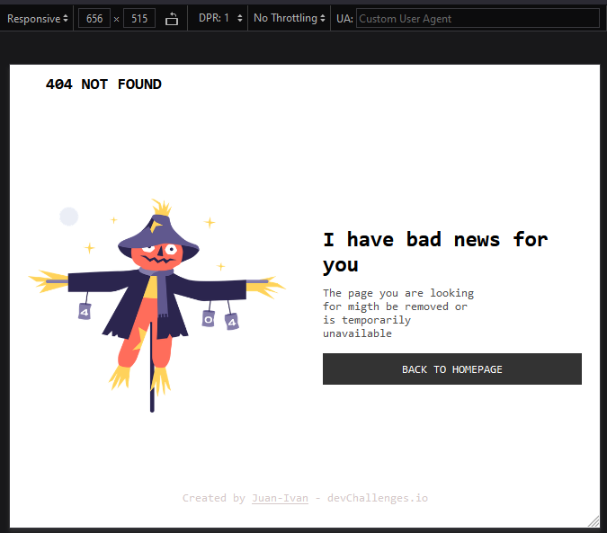
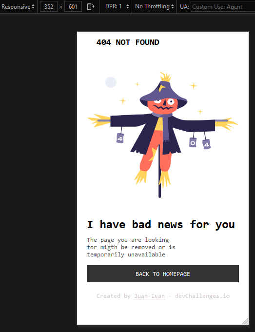

# Make It Real - 404 Not Found Page

This is a solution to the first project of the Make It Real course.

## Table of contents

- [Overview](#overview)
  - [The challenge](#the-challenge)
  - [Screenshot](#screenshot)
- [My process](#my-process)
  - [Built with](#built-with)
  - [What I learned](#what-i-learned)
  - [Continued development](#continued-development)
  - [Useful resources](#useful-resources)
- [Author](#author)
- [Acknowledgments](#acknowledgments)

## Overview

### The challenge

Users should be able to:

- View the optimal design based on your device's screen size.

### Screenshot




## My process

### Built with

- Semantic HTML5 markup
- CSS custom properties
- Flexbox
- Desktop-first workflow

### What I learned

We learned how to use Flexbox and some of its properties to create a layout for the HTML content. For example, how to put images and paragraphs on double columns.

```css
#scarecrow-container {
  flex-basis: 50%;
  display: flex;
  align-items: center;
  justify-content: center;
}
```

For the footer section we used the span tag to decorate just a portion of the paragraph text.

```html
<footer class="p2">
  <p>Created by <span class="subp">Juan-Ivan</span> - devChallenges.io</p>
</footer>
```

Finally, we also learned to put media queries within the CSS sheet to allow responsive desing of our webpage. (check it out when your screen is 375px or less)

```css
@media (max-width: 375px) {
  #main-container {
    display: block;
    height: auto;
  }
}
```

### Continued development

It will be nice to use Grid to create the same layout.

### Useful resources

- [Flexbox tutorial](https://www.youtube.com/watch?v=tXIhdp5R7sc) - This helped me figuring out how to use Flexbox properties.
- [Media queries](https://youtu.be/sd16e11blHI) - This is an amazing tutorial for media queries basic concepts.

## Author

- Github - [Juan Velasco](https://github.com/juandiegovelsol)
- Github - [Ivan Cabulo](https://github.com/icabulo)

## Acknowledgments

Kudos to our friends and mentors: Sergio Jaramilo and Daniel Espitia.
